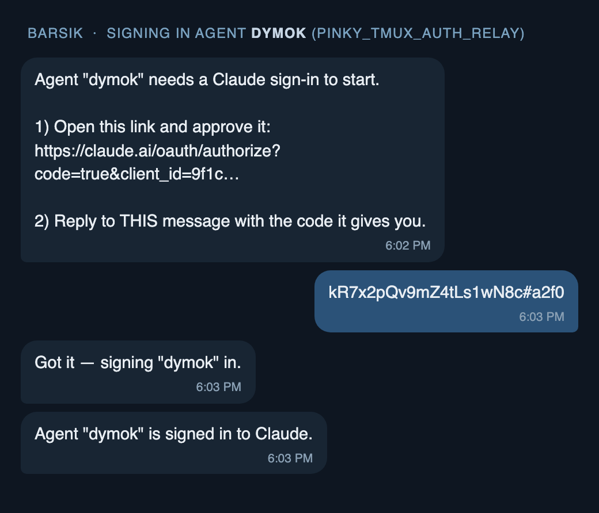

# tmux session OAuth login relay (#205)

**Status:** in build · **Owner:** Barsik · **Reviewer:** Murzik
**Flag:** `PINKY_TMUX_AUTH_RELAY` (default OFF) — byte-identical behavior when off.

## Problem

When a tmux `claude` REPL boots without credentials it sits at the OAuth
login wall forever — prints `https://claude.ai/oauth/...` and waits for a
pasted code. Today the only fix is a human running
`podman exec -it pinky-<agent> claude login` by hand (the documented
`PINKY_CONTAINER_SEED_CREDS=0` path, tmux_session.py:1220-1222).

This is the same pain behind the shared-credential **refresh-token race**
(#202, shared-cred-refresh-race): seeding ONE `~/.claude/.credentials.json`
into N sessions makes them fight over a single-use refresh token. The fix is
to let each session do its **own** login — but that needs a human in the loop.

## Goal

Automate the human-in-the-loop: when a session hits the login wall, relay the
URL to the agent's owner, capture their reply (the code), and inject it into
the waiting pane. Each session self-authenticates → no shared creds file → no
refresh race. (Same Claude account, multiple concurrent device logins — Brad
confirmed 2026-06-15.)

## Owner-facing flow



## Confirmed boot/runtime facts (from code recon)

- A login-walled session **boots to CONNECTED and stays alive** —
  `_spawn_tmux_repl` returns ok (new-session succeeds; tailer starts; there is
  NO pane-readiness gate during boot). It is "live-but-mute."
- The inflight **watchdog only ages in-flight turns** (`_TURN_DONE_TIMEOUT_SEC`
  = 600s → force_restart). With **no turn pasted**, nothing ages → a read-only
  `capture_pane` poller can watch indefinitely without the state machine
  killing the session. **Invariant: the watcher must never paste a probe turn.**
- Injection: `paste_text(code, enter=True)` (bracketed paste, tmux_session.py:510).
- Owner identity: `registry.get_primary_user()["chat_id"]`; owner-gate is
  `message.sender_id == primary["chat_id"]` (broker.py:689-691 pattern).
- Quote-reply correlation: `message.reply_to` carries the replied-to message_id
  (telegram.py:422); reliable for matching the owner's reply to our relay.
- Proactive send to owner: `broker._send_callback(agent, platform, chat_id, text)`.

## Architecture

New module `src/pinky_daemon/auth_relay.py` — a process-wide coordinator
decoupling the TmuxSession watcher (producer of "need auth") from the Broker
intercept (consumer of "here's the code"):

```
TmuxSession._watch_for_oauth_url()        Broker.handle_inbound()
  detect wall (capture_pane -J)             owner quote-replies w/ code
        │                                          │
        ▼                                          ▼
  coordinator.open(agent, url) ──┐        coordinator.submit(agent,
   • resolve owner, send relay   │          reply_to, code) -> bool
   • store pending{relay_mid:fut}│◀───────  • match pending by relay_mid
   • code = await fut (TTL 600s) │          • fut.set_result(code)
        │                        └────────►  • return True (short-circuit)
        ▼
  paste_text(code) → verify wall cleared → notify owner "logged in"
```

`auth_relay.py` surface:
- `extract_oauth_url(pane_text) -> str | None` — pure, de-wraps the URL.
- `extract_auth_code(reply_text) -> str | None` — pure, validates code shape.
- `AuthRelayCoordinator`:
  - `.configure(send_fn, owner_resolver)` — wired at daemon startup.
  - `.enabled()` — `PINKY_TMUX_AUTH_RELAY` (registry-first, env fallback).
  - `async .open(agent_name, url) -> str` — send relay, await code (raises
    `TimeoutError` after TTL; notifies owner on expiry).
  - `.submit(agent_name, reply_to_mid, code) -> bool` — resolve matching future.
  - `.has_pending(agent_name, reply_to_mid) -> bool` — for the intercept gate.

## Integration points (all flag-gated; no-op when off)

1. **tmux_session.py**
   - `__init__`: `self._auth_watcher_task: asyncio.Task | None = None`.
   - End of `_spawn_tmux_repl` (after `_start_tailer`): if enabled, start
     `_watch_for_oauth_url()` task.
   - `_watch_for_oauth_url`: poll `capture_pane(join=True)` every 2s for up to
     ~90s; on URL detect → `code = await coordinator.open(...)` → `paste_text`
     → re-capture to confirm wall cleared. Detect once, never re-relay.
   - `disconnect()`: cancel `_auth_watcher_task` alongside worker/watchdog.
   - `capture_pane`: add `join: bool = False` → appends tmux `-J` (de-wrap the
     long URL across terminal wraps). Backward-compatible default.

2. **broker.py**
   - `handle_inbound` (early, before approval checks): if enabled AND owner AND
     `message.reply_to` AND `coordinator.has_pending(agent, reply_to)` →
     extract code; valid → submit + confirm; invalid → "couldn't read a code,
     reply again with just the code"; either way `return` (consume).
   - Wire `coordinator.configure(self._send_callback, self._registry.get_primary_user)`
     at broker startup.

## Security

- **Owner-only acceptance is load-bearing.** A code from a third party would log
  the agent into the *attacker's* Claude account → session hijack. Accept the
  code ONLY from `sender_id == primary chat_id` AND only when it's a `reply_to`
  our specific relay message. Default-deny.
- **Never log the code.** Logs say "relayed auth URL", "received auth code
  (redacted)", "injected" — never the code or post-injection pane content.
- The relayed URL is the owner's own login on the owner's own channel.

## TTL / failure

- `open()` awaits the code with a 600s TTL (OAuth device codes expire ~10-15m).
  On timeout: notify owner "login link expired — restart the session to retry",
  clear pending, exit watcher. (Re-prompt loop deferred to v2.)
- Coordinator unconfigured / disabled → `open()` is never called (watcher not
  started). Broker intercept short-circuits on `enabled()`.

## Tests

- `extract_oauth_url`: wrapped/unwrapped/absent/multiple-lines.
- `extract_auth_code`: valid code, junk, empty, code-with-surrounding-text.
- coordinator: open→submit happy path; submit wrong agent/mid → False; TTL
  timeout → TimeoutError + owner notified; owner-gate.
- broker intercept: owner+reply+pending → consumed + paste path; non-owner →
  not consumed; reply to unrelated msg → not consumed; flag off → not consumed.
- tmux watcher: simulated pane (wall text) → coordinator.open called; flag off
  → watcher not started; disconnect cancels the task.

## Demo (PR)

Scripted sim: fake login-wall pane → relay message in a test chat → reply with
a code → assert `paste_text(code)` called. Short clip / captured output.
